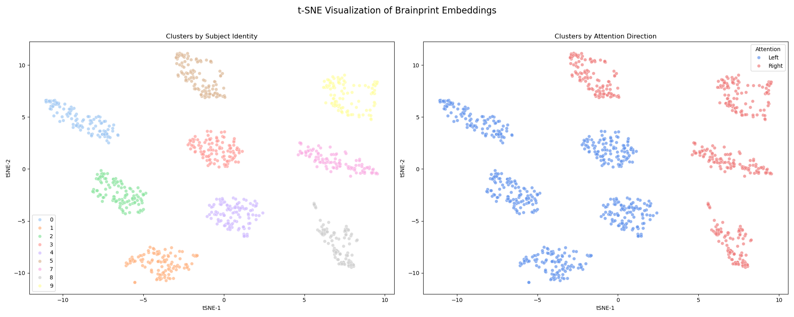
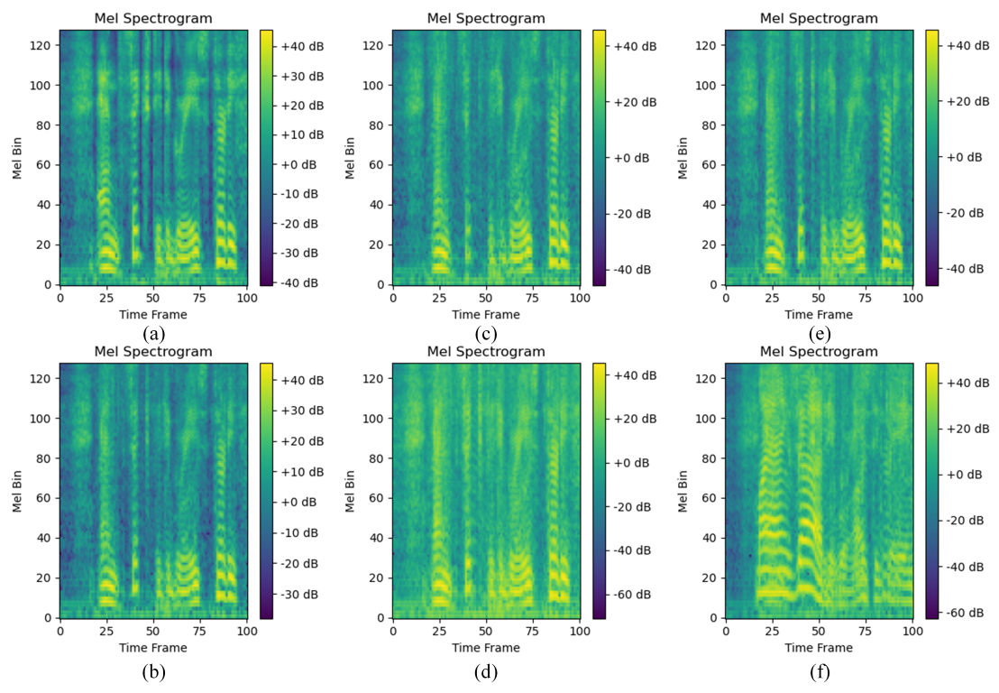

<div align="center">

# BM-TSE

_Brainprint-Modulated Target Speaker Extraction_

[](https://arxiv.org/)
[](LICENSE)
[](https://python.org)
[](https://pytorch.org)

</div>

<div align="center">

</div>

## 🎯 Overview

**BM-TSE** is a novel, end-to-end framework designed for personalized and high-fidelity neuro-steered Target Speaker Extraction (TSE).
It aims to resolve two core issues in existing models: the non-stationarity of EEG signals and high inter-subject variability.

The BM-TSE framework is built on three main innovative pillars:

- Robust EEG Encoding with **Adaptive Spectral Gain (ASG)**: We introduce a robust spatio-temporal EEG encoder featuring an **Adaptive Spectral Gain (ASG)** module.
This module is specifically engineered to extract stable and discriminative features from non-stationary EEG signals.

- Unified Brainmap Embedding via **Joint Supervision**: A novel unified brainmap embedding is learned under the joint supervision of the **Subject Identification (SID)** and **Auditory Attention Detection (AAD)** tasks.
This embedding is forced to encode both the user's static identity (brainprint) and their dynamic attentional state.

- **Personalized Brainprint Modulation**: The central innovation is the brainprint modulation mechanism. The learned brainmap is leveraged to actively refine the separated audio features, dynamically tailoring the output to the specific user's neural patterns.

## 📊 Experimental Results
### 1. Brainprint Visualization
We utilize t-SNE to visualize the **Brainmap Embedding** extracted from the test set. This validates the dual-encoding capability of our framework:

<div align="center">
  
  </div>

### 2. Quantitative Performance
BM-TSE achieves state-of-the-art performance on both the **Cocktail Party** and **KUL** datasets, significantly outperforming existing baselines (e.g., MSFNet, BASEN).

| Dataset | Model | SI-SDR (dB) | STOI | PESQ |
| :--- | :--- | :---: | :---: | :---: |
| **Cocktail Party** | **BM-TSE (Ours)** | **14.02**±0.90 | **0.90** | 2.47 |
| **KUL** | **BM-TSE (Ours)** | **15.92**±0.97 | **0.85** | 2.10 |

### 3. Mel-spectrograms
The provided Mel-spectrograms effectively illustrate the impact of an ablation study on the BM-TSE model’s audio generation quality. The clean audio in Figure (a) serves as the baseline, showing rich, well-defined spectral details. Our high-fidelity benchmark is the complete BM-TSE model, shown in Figure (b), which demonstrates the full model’s effectiveness. The ablation results highlight the critical role of each component. Removing Audio Semantic Guidance (ASG) in Figure (c) leads to a loss of highfrequency detail. Excluding the Speaker Identity Loss (LSID ) in Figure (d) introduces noticeable spectral distortion. The absence of Spectral Convolution (SConv) in Figure (e) causes disruptive, blotchy artifacts, while a lack of Long-Short Term Temporal Convolution (LS-TConv) in Figure (f) blurs the temporal dynamics, significantly degrading the audio's coherence. These comparisons demonstrate that each component of the model is essential for generating high-quality, coherent, and artifact-free audio.

<div align="center">
  
  </div>

## 🔗 Citation

If you use BM-TSE in your research, please cite:

```bibtex
@misc{han2025brainprintmodulatedtargetspeakerextraction,
      title={Brainprint-Modulated Target Speaker Extraction}, 
      author={Qiushi Han and Yuan Liao and Youhao Si and Liya Huang},
      year={2025},
      eprint={2509.17883},
      archivePrefix={arXiv},
      primaryClass={cs.SD},
      url={https://arxiv.org/abs/2509.17883}, 
}
```
