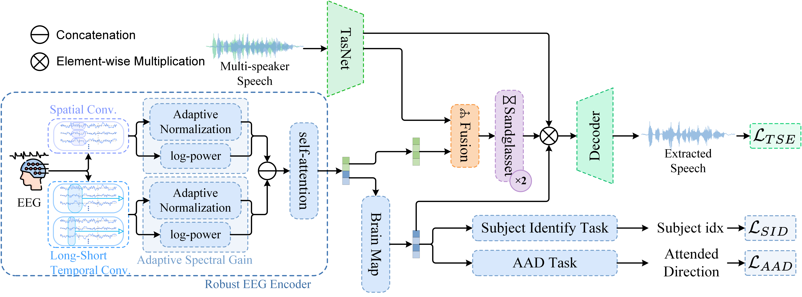

<div align="center">

# BM-TSE

_Brainprint-Modulated Target Speaker Extraction_

[](https://arxiv.org/)
[](LICENSE)
[](https://python.org)
[](https://pytorch.org)

</div>

<div align="center">

</div>

## 🎯 Overview

**BM-TSE** is a novel, end-to-end framework designed for personalized and high-fidelity neuro-steered Target Speaker Extraction (TSE).
It aims to resolve two core issues in existing models: the non-stationarity of EEG signals and high inter-subject variability.

The BM-TSE framework is built on three main innovative pillars:

- Robust EEG Encoding with **Adaptive Spectral Gain (ASG)**: We introduce a robust spatio-temporal EEG encoder featuring an **Adaptive Spectral Gain (ASG)** module.
This module is specifically engineered to extract stable and discriminative features from non-stationary EEG signals.

- Unified Brainmap Embedding via **Joint Supervision**: A novel unified brainmap embedding is learned under the joint supervision of the **Subject Identification (SID)** and **Auditory Attention Detection (AAD)** tasks.
This embedding is forced to encode both the user's static identity (brainprint) and their dynamic attentional state.

- **Personalized Brainprint Modulation**: The central innovation is the brainprint modulation mechanism. The learned brainmap is leveraged to actively refine the separated audio features, dynamically tailoring the output to the specific user's neural patterns.

## 🔗 Citation

If you use BM-TSE in your research, please cite:

```bibtex
@misc{han2025brainprintmodulatedtargetspeakerextraction,
      title={Brainprint-Modulated Target Speaker Extraction}, 
      author={Qiushi Han and Yuan Liao and Youhao Si and Liya Huang},
      year={2025},
      eprint={2509.17883},
      archivePrefix={arXiv},
      primaryClass={cs.SD},
      url={https://arxiv.org/abs/2509.17883}, 
}
```
